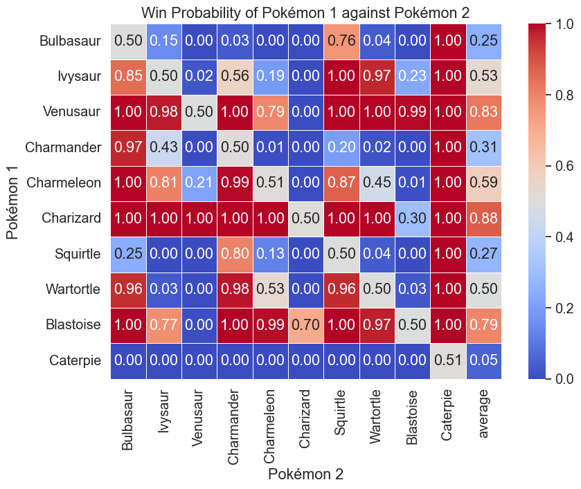
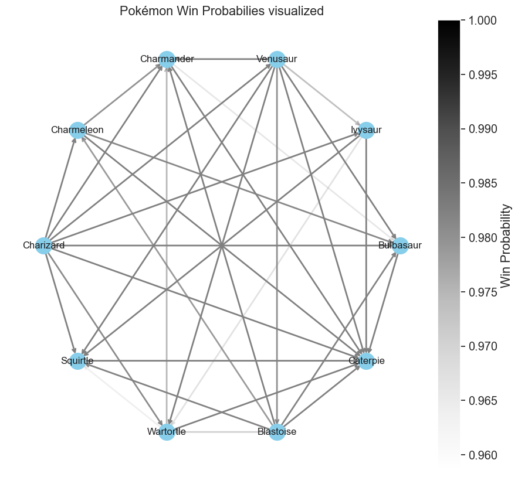

# Best Pokémon Team

## Abstract
This bachelor's thesis concerns itself with the finding of the best Pokémon Team under several given assumptions. With the Pokémon franchise now encompassing over 1000 Pokémon and additional ~100 being released every generation, each with their own set of stats and features, identifying the best team poses a very challenging question. This Project makes use of a dataset and uses different approaches to find the best Pokémon team. The methodology includes simulation of battles between individual Pokémon and teams and also several graph theory approaches to find the best team. We can show that the selection of our algorithm is significantly better than a more common "naive" selection technique employed by some players. Future research directions could include a less restricted definition of the problem statement and including a more sophisticated battle simulation between Pokémon.


## Table of Contents
# Table of Contents

- [Abstract](#abstract)
- [1. Introduction](#1-introduction)
  - [1.1 Motivation](#11-motivation)
  - [1.2 Problem Statement](#12-problem-statement)
  - [1.3 Objectives](#13-objectives)
  - [1.4 Methodology Overview](#14-methodology-overview)
  - [1.5 Thesis Structure](#15-thesis-structure)
- [2. Methodology](#2-methodology)
  - [2.1 Research Design](#21-research-design)
  - [2.2 Data Collection](#22-data-collection)
  - [2.3 Pokémon](#23-pokémon)
  - [2.4 Data Analysis](#24-data-analysis)
  - [2.5 Algorithmic Approaches](#25-algorithmic-approaches)
  - [2.6 Summary](#26-summary)
- [3. Implementation](#3-implementation)
  - [3.1 Battle Simulation](#31-battle-simulation)
  - [3.2 Graph Theory Algorithms](#32-graph-theory-algorithms)
  - [3.3 Iterative Algorithm](#33-iterative-algorithm)
  - [3.4 Incremental Team Optimization](#34-incremental-team-optimization)
- [4. Results](#4-results)
  - [4.1 Results Battle Simulation](#41-results-battle-simulation)
  - [4.2 Results Graph Theory Algorithms](#42-results-graph-theory-algorithms)
  - [4.3 Iterative Approach](#43-iterative-approach)
  - [4.4 Incremental Team Optimization](#44-incremental-team-optimization)
- [5. Conclusion](#5-conclusion)
  - [5.1 Future Research Directions](#51-future-research-directions)
- [6. References](#6-references)


## 1. Introduction
For many, unlike myself, Pokémon was their first portal into the realm of gaming. Pokémon is set in a world where you and the namegiving creatures, Pokémon, are best friends. You can catch Pokémon, battle them and conquer the rankings to become Pokémon master. The only catch is, at any point in the game you may only be with a team of at most six Pokémon, making the selection of the right Pokémon and ordering even more important. Only very little gaming franchises manage to keep such a large fanbase content over so many years of creating new and unique Pokémon. Whats their secret to this success? Could it be that the game developers meticulously balanced every Pokémon in such a way that they each can be viable in certain cenarios and team constellations? To test this hyptothesis I was tasked with finding a significantly better Pokémon team than a naively chosen baseline. This is not only an interesting question for many enthusiasts all over the world but also presents a rich field for computational analysis.

### 1.1 Motivation
The motivation for this particular problem stems from the personal fascination in optimizing each component when gaming and the general interest for the Pokémon franchise while also presenting interesting concepts in the fields of optimization problems, game theory and probability. By tackling these fields this study aims to contribute to the broader understanding of strategic game design and optimization problems with the possibility to extend that knowledge to beyond the realm of Pokémon.

### 1.2 Problem Statement
Despite the many different approaches found online there remains no agreed upon standard of finding the best Pokémon team. Even the strongest Teams will get beaten by another team which counters their strengths. This study defines "best" as the ability of the team to adapt and succeed against a wide range of opposing teams and beat a naive team selection process along the way.

### 1.3 Objectives
The primary objective of this study is to develop and apply algorithms to identify highly effective Pokémon and constellations giving us ground to conclude wether a "best" Pokémon team exists. Secondary objectives include measuring the effectiveness of the mentioned algorithms, analyzing the results to determine deciding factors for a "strong" team and visualizing/analyzing different data sets.

### 1.4 Methodology Overview
To achieve these goals, the study will make use of data analysis, algorithmic design and simulations. Earlier stages will involve getting familiar and preprocessing the data while later stages will involve the design and testing of various optimization algorithms. The criteria for evaluating the performance of an algorithmic approach will be based on simulations against a range of opponent teams and the comparison with a so called threshold team.

### 1.5 Thesis Structure
The remainder of the thesis is structured as follows: Chapter 2 will outline the methodology applied, Chapter 3 presents the implementation and testing phase of all algorithms used. Chapter 4 will discuss the results and findings and Chapter 5 will end the study with a conclusion and discussion of possible future work.


## 2. Methodology
This Chapter will outline the methodology employed to identify the optimal Pokémon team composition. Given the complexity an sheer amount of data caused by over 800 Pokémon with all their stats and abilities this study makes use of several algorithmic approaches such as graph theory, iterative algorithms and breaking down the problem into smaller problems. The methodologies are designed to effectively and rigorously test and validate the best Pokémon team against a wide range of opposing team constellations and a threshold team selected during validation.

### 2.1 Research Design
The research follows a quantitative approach focused on measurable performance to asses the strength of a team. An experimental research design was used where strong teams found by the algorithm were tested against several thousand opponent teams and then compared to the performance of a naivly chosen "best team" which consists of the top six individually best performing Pokémon. This design gave us ground to assess team performance based on measurable performance metrics such as win-probability against random teams and the baseline of the naively chosen "best team".

### 2.2 Data Collection
The Data used for this Project was provided to me by my supervisor in form of a dataset on Kaggle [^1]. The data contains over 800 Pokémon, all their learnable abilities, stats and most relevant features to build a battle simulation. Although the data was far from perfectly curated it gave me a base to quickly jump right into the data analysis and development of my methodology.

### 2.3 Pokémon
This section is a little interjection but necessary to fully explain the workings of pokémon. As already mentioned Pokémon are what this project is mainly about. Pokémon derived from the word pocket monsters are little animal like creatures the player is able to catch and battle for sport against other players. Each Pokémon is consists of a few main components which makes them unique:

Base Stats: Fundamental attributes that determine a Pokémon's capabilities ranging from 1 - 255. These are species-specific and include:
- HP (Hit Points): The health of the Pokémon.
- Attack: The strength of the Pokémon's physical attacks.
- Defense: The Pokémon's resistance to physical attacks.
- Special Attack: The strength of the Pokémon's special (non-physical) attacks.
- Special Defense: The Pokémon's resistance to special attacks.
- Speed: Determines the order of moves in battle.
  
Effort Values (EVs): Points that enhance base stats which are gained after completed battles. Intended to reward the player for sticking to the same Pokémon. The values range from 1 - 255 but capped at a sum of 510 across all 6 EVs.

Individual Values (IVs): Inherent values that add to base stats meant to make each Pokémon unique. These values are randomly assigned from 0 - 31.

Nature: Affects the growth of certain stats. For each nature one base stat will be increased by 10% and one will be decreased by 10%.

Level: For each Level the Pokémon gains their stats will be increased by 1/50 the base stat value, and 1/100 the combined individual value and effort value.

Type: Each Pokémon has at least one and at most two unique types out of possible 18 different types. This leaves us with 324 type combinations which each Pokémon is assigned one of.

Moves: Based on its type and level each Pokémon can learn up to 4 moves which have a specific type and are either normal or special attacks. Given the attack type of the move and the attacking and attacked type of the Pokémon the damage will be calculated.

Calculation of final HP:
${\displaystyle \mathrm {HP} =\left\lfloor {(2\times \mathrm {Base} +\mathrm {IV} +\lfloor {\tfrac {\mathrm {EV} }{4}}\rfloor )\times \mathrm {Level} \over 100}\right\rfloor +\mathrm {Level} +10}$

Calculation of final remaining stats:
${\displaystyle \mathrm {OtherStat} ={\Biggl \lfloor }{\biggl (}{\Bigl \lfloor }{(2\times \mathrm {Base} +\mathrm {IV} +\lfloor {\tfrac {\mathrm {EV} }{4}}\rfloor )\times \mathrm {Level} \over 100}{\Bigr \rfloor }+5{\biggr )}\times \mathrm {Nature} {\Biggr \rfloor }}$


### 2.4 Data Analysis
In an initial step the data set was carefully examined and corrected where necessary to ensure proper behavior when used for the algorithms and especially the battle simulation. Given the size of the dataset and complexity of all the connections, several inconsistencies have been identified, such as following different naming conventions, missing id's and other little things which could break the battle simulation if unnoticed. All those little inconsistencies where found and corrected progressively in the process of developing the algorithms.

For the analysis and everything else python emerged as the programming language of choice due to its great support for datascience through libraries such as pandas, numpy, seaborn, matplotlib and network-x which enabled me to really get a feel for the data and the behavior of it.
The biggest chunk of the analysis was statistical with some venturing into graph theory in between. It was needed to uncover statistical advantages in the Pokémons attributes such as types, attacks and average stats which all could influence the outcome of a battle. Visualization played a pivotal role firstly for the identification of mistakes in the process and also the intuitive understanding of data trends and distributions. Graphtheory mostely was used to identify any connections between Pokémon and their peers to identify individually strong Pokémon or more so called "team-players" which only thrive in certain team constellations.

The analytical approach highlights underlying patterns and relations in the underlying data. The rigorous data cleaning, analysis and visualization paved the way for the development of the algorithms and the subsequent battle simulation phase of the research.

#### 2.4.1 Assumptions
Certain assumptions had to be made to facilitate the analysis process and manage complexity. All Pokémon in the dataset are assumed to be at level 80, with effort values (EVs) set to 85 and all individual values (IVs) set uniformly to 16 across all base stats. Furthermore, the nature of all Pokémon is assumed to be hardy. All those values have been chosen to be either the mean value or assure even attribute distribution to have minimal effect. This is contrary to the actual game where almost each attribute is chosen at random making every Pokémon unique and it being impossible to create reproducable results. These simplifications allow for a more manageable analysis process and prevent unnecessary complexity that could otherwise blow the project out of proportion. Experienced Pokémon players may notice that some attributes of Pokémon like for example gender and abilities are still missing. These are deliberatly ommitted, as they are deemed unnecessary for battling and are therefore excluded from our research. 
As for the move selection I chose a relatively naive approach by precomputing the strongest moves and assigning each Pokémon the top 4 "hardest hitting" moves without regard for the situation or opponent. This brings us to the next section: The Battle Simulation.

### 2.4.2 Battle Simulation
This entire project would be impossible to carry out without the battle function. The simulation serves as the foundation for all our assumptions and is crucial for verifying the findings of our simulations. The battle simulation is mainly based on the detailed information available on Bulbapedia. These articles outline the very details of how damage is calculated and how battles are fought out in Pokémon games. Due to the scope limitations of this project, I only focused on the most relevant factors that influence the overall outcome of a battle, such a Pokémons move sets, basic stats and type advantages.

This reduces the formula A:

${\displaystyle {\text{Damage}}=\left({\frac {\left({\frac {2\times {\text{Level}}}{5}}+2\right)\times {\text{Power}}\times {\frac {A}{D}}}{50}}+2\right)\times {\text{Targets}}\times {\text{PB}}\times {\text{Weather}}\times {\text{GlaiveRush}}\times {\text{Critical}}\times {\text{random}}\times {\text{STAB}}\times {\text{Type}}\times {\text{Burn}}\times {\text{other}}\times {\text{ZMove}}\times {\text{TeraShield}}}$

to formula B:
 
${\displaystyle {\text{Damage}}=\left({\frac {\left({\frac {2\times {\text{Level}}}{5}}+2\right)\times {\text{Power}}\times {\frac {A}{D}}}{50}}+2\right)\times {\text{random}}\times {\text{STAB}}\times {\text{Type}}}$


To put this into perspective, I will reference Pokémon Showdown, the main competitive platform Pokémon enthusiasts turn to. Its developement started in 2012 as an open source project and is still ongoing. This highlights the complexity and depth of accurately simulating Pokémon battles taking into account all the niche cases like weather, held items, status effects ecetera. By limiting the scope to the most critical elements, the battle simulation aims to provide a realistic yet manageable representation of Pokémon battles and serves as the base for this project.

### 2.5 Algorithmic Approaches
In this Section I will go over all the different approaches I used to evaluate wether there is a significantly better team than a naivly selected team based on the simulation against a generous amount of randomly generated teams. The foundation of all my algorithmic approaches is an initial simulation where each Pokémon battles against every other Pokémon to determine which ones perform the best individually giving me a starting point for all my approaches.

#### 2.5.1 Graph Theory Algorithms
In the early stages I primarily concerned myself with graph theory and ranking algorithms to get a feel for the individual Pokémon. Using the network library NetworkX I quickly was set up for initial analysis of all Pokémon and their relations. Using this Network which has a node for each Pokémon and an edge from Pokémon A to B if Pokémon A beats Pokémon B with $\text{probability p} \geq \text{threshold}$ . Initially I was on the lookout for Kings and Dominating Sets. Kings are defined as as Vertices which can reach any Vertex through a path of length 1. A n-King is a Vertex which does the same but using n Edges. Using this I wanted to Rule out the exisence of clear *must Pick* Pokémon. Besides that I looked into the existance of minimal Dominating Sets where the Vertex count is $\leq 6$ . A dominating Set D is a Vertex subset of a graph G where each Node of G is either in D or gets dominated (has an incoming node) from D. By attempting to find such a dominating set I investigated the existance of good teams which "dominate" the whole list of remaining Pokémon forming a good team.

#### 2.5.2 Iterative Methods
After finishing up the Graph Theoretical approach of identifying a best Pokémon team I mainly concerned myself with an iterative approach which starts out with a randomly assembled team and tries to converge onto a *best team* by improving the randomly assembled team iteratively. Due to very similar results in performance between the top teams when improving over and over again I needed to look into reducing the overall noise in the win probability. The noise in win probabilities was assumed to exist because of many random teams battles outcomes being clear due to super weak Pokémon. To distinguish the great teams from the good in this noise I either had to run many magnitudes more battles or I needed a way to remove super weak Pokémon out of the random opponenets. Besides that not every Pokémon had a realistic chance of being selected into the final 6 of the *best team* possibly reducing the number of rounds the algorithm had to run. This is assumed to be due to certain Pokémon being either consistently to weak or there existing a Pokémon which outperforms the weaker Pokémon in every stat category.

Generally the algorithms used to tackle these problems can be divided into two groups. Firstly Algorithms which have been used to shrink the number of Pokémon which might belong into the best Pokémon team, lets call this candidate pool, and secondly reducing the number of Pokémons which a team can face to give battles some meaning and reduce overall noise, called opponent pool.

The candidate- and opponent pool are assumed to be equal in the beginning with every Pokémon being in it. The main practices used to reduce the size of the pools is based upon previous data analysis. The process of reducing the aforementioned pools revolved around the question "can this Pokémon be replaced directly by one or more Pokémon which are equally as good or better in all its relevant stats?". For this I tried several strategies:

##### Top performing Pokémon by Type Stats and Battles
There are 324 ( $\binom{18}{2} + 18$ ) type combinations. I looked at every other same typed Pokémon A and B and checked if Pokémon B has equal or better stats than Pokémon A and beats all opposing Pokémon. If so B can replace A.

##### Top performing Pokémon by Stats and Batles
When looking at the data and finding two pokémon who beat the same Pokémon we can eliminate the "weaker one" if all of its stats are equal or worse than those of the stronger one.

##### Top n performing Pokémon by type
Using the same approach we can reduce the number even further by just picking the top n Pokémon for each type combination. This in the best case gives us at minimum 171 Pokémon, one for each type, since only 171 of the 324 type combinations are used.

#### 2.5.3 Incremental Team Optimization Approach
This is the final approach I used to tackle the problem. It revolves around the idea of breaking the problem down into smaller subproblems and figuring out any relations which might be helpful in concluding something about the bigger problem. In this concrete case I started with the top 20 individually performing Pokémon. Then I formed teams of two out of those top 20 individual Pokémon and simulated battles against random opponent teams of size 2. I followed this this up by forming teams of 3 of the teams of 2 and continued this process until I reached teams of size 6.

### 2.6 Summary
My supervisor provided me with the flexibility to explore several approaches, as there is no clear best way to tackle such a complex optimization problem. This allowed me to be dynamic and adaptive with my research, enabling me to experiment with graph theoretical methods, iterative techniques, and simulation-based evaluations, leading to a more exploratory and on the go process.


## 3. Implementation
In this implementation section, I will over the key components behind the different approaches. While I won't cover every detail here, those interested in the full implementation can have a look at the code, which is available in the GitHub repository [^2]. One thing you will often see is the conversion from .csv files into dictionaries due to them showing better lookup performance than pandas dataframes. Generally everything that can be precomputed is precomputed and stored inside a dictionary.

### 3.1 Battle Simulation
The battle simulation consists of three main parts: the Pokémon class, Team class and the Battle functions. Both of these classes will be touched upon in the following subsections.

#### 3.1.1 Pokémon Class
The Pokémon class initializes each Pokémon with its base stats, top moves, and calculated stats based on fixed EVs, IVs, and nature:
- **Initialization**: Retrieves base stats, top moves, type and calculates the final stats for each Pokémon.
- **Stat Calculation**: Functions to calculate stats based on the Pokémon's base stats, EVs, IVs, and nature.
- **Reset HP**: Resets the Pokémon's battle HP to its base HP. This is done so I can quickly reset a Pokémon in battle to its normal HP after it faints and not create a completely new Pokémon everytime.
- **Retrieve Moves**: Retrieves the top moves for each Pokémon which are selected to be the strongest moves by damage.
- **Print Stats**: Prints the Pokémon's stats for debugging purposes.


#### 3.1.2 Team Class
The Team class initializes a team of Pokémon, ensuring unique Pokédex numbers and filling the team to the required size if necessary:
- **Initialization**: 
  - Takes a variable number of Pokémon IDs and a team size. Which is especially important for the Incremental Team Optimization Approach.
  - Ensures that the team consists of unique Pokémon based on their Pokédex numbers as we will not allow for teams with non unique Pokémon.
  - Fills the rest of the team with random, unique Pokémon if the provided IDs are insufficient to meet the team size.
- **Reset**: 
  - Resets the HP of all Pokémon in the team to their base HP.
- **String Representation**: 
  - Provides a string representation of the team, listing each Pokémon and their base HP for debugging purposes.


#### 3.1.3 Battle Function
The Battle class manages battles between two teams of Pokémon, handling individual battles and determining the overall winner:

- **teamBattle**: 
  - Manages a full battle between two teams of Pokémon.
  - Determines the winner based on which team's Pokémon faint first.
- **battle**:
  - Conducts a battle between two individual Pokémon.
  - Determines the first attacker based on speed and alternates attacks until one Pokémon faints.
- **attack**:
  - Handles the logic for one Pokémon attacking another.
  - Chooses a random move of a precomputed list of 4 moves, calculates damage, and updates the defending Pokémon's HP.

### 3.2 Graph Theory Algorithms
This is a trivial section since most of the graph theory algorithms were implemented using the NetworkX library and only little adjustements or loops have been introduced. Key algorithms and methods used include:

#### 3.2.1 Creating Directed Graph based on Simulation:
Created directed graphs G from Pokémon battle outcomes, adding edges between Pokémon A and B if A beats B with a probability $\geq 0.9$.

#### 3.2.2 Dominating Sets:
Utilized `nx.dominating_set(G)` to find a random dominating set. The problem of finding smallest dominating sets is computationally demanding and only bruteforcable for smaller subsets of all Pokémon. The following codes do this in a naive brute force way and attemt to find a dominating set using the nodes ranked descendingly by their out-degree:

    ```python 
    def brute_find_dominating_sets(G):
        nodes = list(G.nodes())
        dominating_sets = []
        found_size = None
        
        for i in range(1, len(nodes) + 1):
            if found_size is not None and i > found_size:
                break
            for subset in itertools.combinations(nodes, i):
                if nx.is_dominating_set(G, subset):
                    if found_size is None:
                        found_size = i
                    if i == found_size:
                        dominating_sets.append(set(subset))
    
        return dominating_sets
            
    def out_degree_dominating_set(G):
        sorted_nodes = sorted(G.nodes(), key=lambda x: G.out_degree(x), reverse=True)
        
        S = set()
    
        for node in sorted_nodes:
            S.add(node)
            if nx.is_dominating_set(G, S):
                return S
    
        return None
    ```

#### 3.2.3 Finding k-Kings:
Implemented a custom function to find k-kings in the directed graph, defined as Pokémon from which every other Pokémon is reachable within k edges:

    ```python
    def is_king(graph, vertex):
        shortest_paths = nx.single_source_shortest_path_length(graph, vertex, cutoff=1)
        return len(shortest_paths) == len(graph.nodes)

    def find_kings(graph):
        kings = []
        for vertex in graph.nodes:
            if is_king(graph, vertex):
                kings.append(vertex)
        return (kings, len(kings))

    find_kings(G)
    ```

### 3.3 Iterative Algorithm
The following algorithm iteratively identifies top-performing Pokémon teams by simulating battles and refining the selection of Pokémon IDs over multiple iterations.

1. **Initialization**:
    - Start with a random sample of Pokémon IDs (`subset_size`) which is usually set to 12.
    - Set parameters for the maximum number of iterations, the number of top teams to consider for the recurring IDs, the number of battles to start with in the first generation, and the number of battles to end with in the last generation.

2. **Iterative Process**:
    - For each iteration:
        - **Generate Opponent Teams**: Create a set of fixed opponent teams by randomly sampling Pokémon IDs and adding any custom teams provided.
        - **Simulate Battles**: Use the `run_battle_simulation` function to simulate battles between the generated teams and record win counts for each team.
        - **Identify Top Performers**: Sort teams by their win counts to identify the top 10 teams and extract the 6 most frequently occurring Pokémon IDs.
        - **Update Pokémon IDs**: Replace some of the current set of Pokémon IDs with the top-performing Pokémon IDs if they are not already in it and introduce 6 new IDs to maintain diversity and form the new 12 IDs.
        - **Check Specific Team Performance**: Calculate the win rate of the threshold team and track better-performing teams.

3. **Output**:
    - The algorithm returns the top Pokémon IDs after the final iteration and prints running win percentages of the top 10 teams along the way.


### 3.4 Incremental Team Optimization
Given the computational complexity of simulating battles for teams of size 6, we started with smaller subproblems. The main idea is to:

1. Identify the top 20 individually performing Pokémon.
2. Create all possible pairs (combinations) from these 20 Pokémon.
3. Predict the outcomes of the battles against random teams based on their individual performance.
4. Simulate battles between these pairs and random teams to evaluate their performance.
5. Compare the rankings between the prediction and simulation to gain insights about wether predicting good performing teams is possible.
6. Incrementally build larger teams by fusing smaller teams, adding one Pokémon at a time, based on shared members.

#### Process Summary

1. **Create Initial Teams**: Form all `20 choose 2` pairs from the top 20 Pokémon.
2. **Predict Performance**: Use the performance of smaller teams to predict the performance of the newly formed larger teams.
3. **Simulate Battles**: Evaluate the performance of these pairs against random teams.
5. **Compare**: Compare the results with the predictions to gain insights about the quality of the prediction.
6. **Repeat**: Continue the process, increasing the team size by one each iteration until reaching teams of size 6.


## 4. Results
Let's now look at the results of each attempted approach. We will go through each approach one by one and revisit them in detail. Using graphs and figures I will try to highligh some of the findings. The primary goal is to evaluate the effectiveness of each strategy and to collect the insights gained from these analyses.

### 4.1 Results Battle Simulation
While the battle simulation results do not directly pinpoint the optimal Pokémon team, they offer valuable insights into the performance characteristics and interactions of different team configurations. These findings lay the groundwork for more targeted analyses and highlight the complexity of the optimization problem. The visualizations included in this section help convey the nuances of the data, offering a clear view of the underlying dynamics at play and are a fun visualization for Pokémon fanatics.




**The top 10 individual performing Pokémon for the 1. Generation are:**
| *Rank* | *Pokémon* | *Win Probability* |
| --- | --- | --- |
| 1. | Mewtwo | 0.9674788079470197 |
| 2. | Snorlax | 0.9408999999999995
| 3. | Dragonite | 0.9162225165562912 |
| 4. | Moltres | 0.8931192052980129 |
| 5. | Arcanine | 0.8722357615894036 |
| 6. | Zapdos | 0.865892715231788 |
| 7. | Tauros | 0.8606562913907281 |
| 8. | Hypno | 0.8387019867549668 |
| 9. | Gengar | 0.8267139072847685 |
| 10. | Hitmonchan | 0.8225529801324505 |

**The top 10 individual performing Pokémon for the the whole Dataset are:**
| *Rank* | *Pokémon* | *Win Probability* |
| --- | --- | --- |
| 1. | Giratina (Altered Forme) | 0.9610472568578559 |
| 2. | Lunala | 0.9590593516209487
| 3. | Arceus (Normal) | 0.9504522443890281 |
| 4. | Dialga | 0.9480451371571083 |
| 5. | Solgaleo | 0.9387623441396511 |
| 6. | Ho-Oh | 0.9352665835411477 |
| 7. | Lugia | 0.9319522443890287 |
| 8. | Mewtwo | 0.925636034912718 |
| 9. | Reshiram | 0.9232175810473824 |
| 10. | Magearna | 0.9210951371571086 |

This gives us the following naively picked best team: *Giratina (Altered Forme), Lunala, Arceus, Dialga, Solgaleo, Ho-Oh*

### 4.2 Results Graph Theory Algorithms
In this section, we delve into the application of graph theory to analyze the interconnections and performance of Pokémon teams. We begin with a graphic that illustrates the different interconnections within a graph, providing a visual representation of the relationships and interactions between the first 10 Pokémon based on their battle outcomes:


#### 4.2.1 Dominating Sets
Using our functions for dominating sets we find the following dominating sets in the first 151 Pokémon:

`out_degree_dominating_set(G)`: *Snorlax, Mewtwo, Dragonite*  
`brute_find_dominating_sets(G)`: *{Dragonite, Gengar, Snorlax}, {Dragonite, Mewtwo, Snorlax}* 
`nx.dominating_set(G)`: *Alakazam, Mew, Krabby, Zapdos, Tentacool, Poliwrath, Dugtrio, Pinsir, Magneton, Golduck, Tentacruel, Starmie, Omastar, Mewtwo, Exeggutor, Dragonite, Haunter*

Using the existing function `nx.dominating_set(G)` is not an option due to its randomness when finding dominating sets as they are not minimal. The functions implemented by myself are a lot quicker in the case of the `out_degree_dominating_set(G)` function and find a minimal subset in both of my implemented functions. For bigger subsets of the whole dataset we cannot really find any minimal dominating sets as it turns out to be too computationally demanding. Although not possible for bigger subsets I confirmed that all 4 Pokémon (*Dragonite, Gengar, Snorlax, Mewtwo*) found in the minimal dominating sets were present in the top performing teams of size 6 in the incremental team optimization.


#### 4.2.2 Finding k-Kings
No 1-kings k = 1  were identified in the analysis. For the first generation of Pokémon, Snorlax was the only Pokémon identified as a 2-king. Across all 802 Pokémon, Lunala was identified as a 2-king. If we further increase k, we find too many Pokémon, making meaningful analysis difficult.

### 4.3 Iterative Approach
Using this approachIwas not able to identify any significantly better teams. It happend that the naively selected threshold team got outperformed in certain iterations but the threshold team always ended back on top in the final iteration.

### 4.4 Incremental Team Optimization
The findings from the Incremental Team Optimization are the most interesting for this project. I was unable to predict the outcomes based on the results of smaller teams removing the option of shortcutting the simulation process by predicting the outcomes. When identifying the top 20 perfoming teams of size 6 we find that the threshold team consistently gets outperformed over a simulation of 1000000 battles. Despite the difference in win probabilities being only minimal (a few ~100 wins over a simulation of 1000000 battles) the results are statistically significant according to Spearman's rank correlation coefficient with a p-value of `0.0038529945186214815`. Notably, Lunala, our only identified 2-king, is highly present (15/20 teams) in the top 20 performing teams. This suggests that our initial approach of looking for k-kings as essential picks is indeed a valid strategy.

## 5. Conclusion
Over the course of my project,I identified a best-performing Pokémon team, although it only marginally outperformed other teams. Using graph theory proved to be a helpful tool in reasoning about Pokémon teams, offering insights into their strengths and interactions. This approach can be particularly useful in identifying key Pokémon and understanding the dynamics of team compositions. Despite the marginal improvement, the findings highlight the potential of graph theory and iterative team improvements as a valuable framework for analyzing and optimizing Pokémon teams.

### 5.1 Future Research Directions

If I had more time to dedicate to the project, I would explore a more sophisticated move selection process for the Pokémon, ensuring that each move set is optimized for various battle scenarios. This would involve a detailed analysis of move effectiveness and synergy with team strategies.

Additionally, I would concentrate on team constellations, identifying which Pokémon work well together and how their combined strengths can be maximized. This aspect is crucial for building balanced and synergistic teams that can handle diverse opponents effectively.

Moreover, I would aim to refine the iterative approach further. Although it showed some potential, the results turned out to be quite ineffective at finding a significantly better team. By enhancing the iterative method, I believe improvements in team performance could be achieved. This would involve fine-tuning the algorithms used, increasing the number of iterations, and incorporating more sophisticated evaluation metrics to better capture the dynamics of Pokémon battles.

In summary, these refinements and deeper analyses would likely yield more robust and effective Pokémon team compositions, leveraging the full potential of the data and methodologies applied in this research.


## 6. References
[^1]: [Kaggle dataset](https://www.kaggle.com/datasets/mylesoneill/Pokémon-sun-and-moon-gen-7-stats?select=moves.csv).
[^2]: [GitHub Repository](Testtest)
