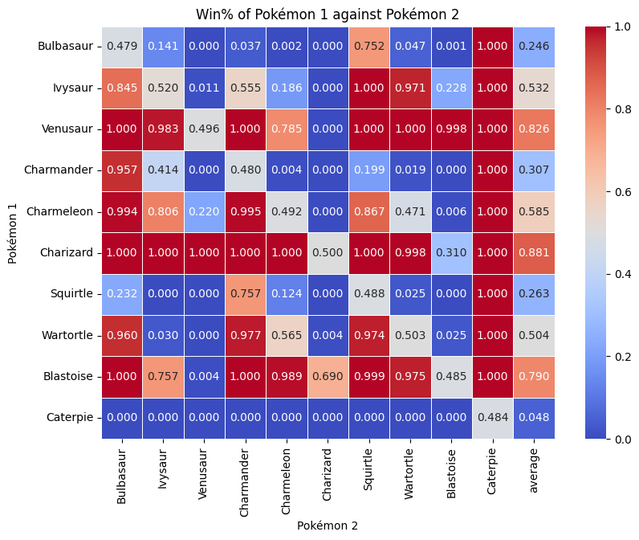
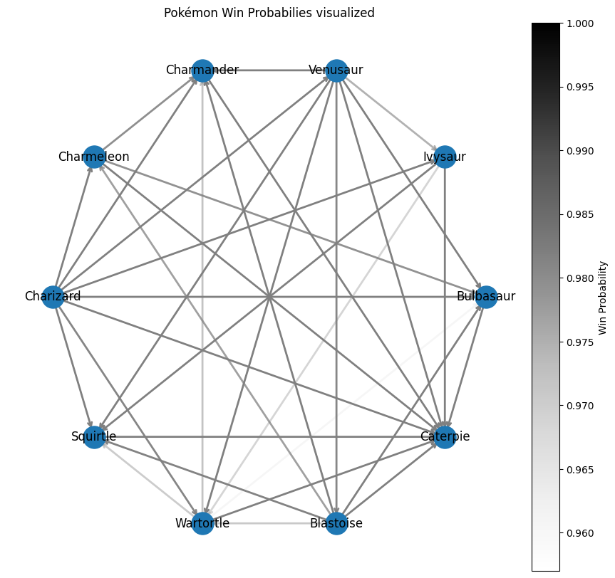

# Best Pokémon Team

## Abstract

This bachelor's thesis concerns itself with the finding of the best Pokémon Team under several given assumptions. With the Pokémon franchise now encompassing over 1000 Pokémon and additional ~100 being released every generation, each with their own set of stats and features, identifying the best team poses a very challenging question. This Project makes use of a dataset and uses different approaches to find the best pokemon team. The methodology includes simulation of battles between individual pokemon and teams and also several graph theory approaches to find the best team. We can show that the selection of our algorithm is significantly better than a more common "naive" selection technique employed by some players. This work is not only interesting for the pokemon community by providing them with a scientific approach of team selection but has its roots in many optimization problems such as ?. Future research directions could include a less restricted definition of the problem statement and including a more sophisticated battle simulation between Pokémon.


## Table of Contents
- [1. Introduction](#1-introduction)
    - [1.1 Motivation](#11-motivation)
    - [1.2 Problem Statement](#12-problem-statement)
    - [1.3 Objectives](#13-objectives)
    - [1.4 Methodology Overview](#14-methodology-overview)
    - [1.5 Thesis Structure](#15-thesis-structure)    
- [2. Methodology](#2-methodology)
    - [2.1 Introduction to Methodology](#21-introduction-to-methodology)
    - [2.2 Research Design](#22-research-design)
    - [2.3 Data Collection and Assumptions](#23-data-collection-and-assumptions)
    - [2.4 Data Analysis](#24-data-analysis)
        - [2.4.1 Assumptions](#241-assumptions)
        - [2.4.2 Battle Simulation](#242-battle-simulation)
    - [2.5 Algorithmic Approaches](#25-algorithmic-approaches)
        - [2.5.1 Graph Theory Algorithms](#251-graph-theory-algorithms)
        - [2.5.2 Iterative Methods](#252-iterative-methods)
        - [2.5.3 Incremental Team Optimization Approach](#253-incremental-team-optimization-approach)
    - [2.6 Conclusion](#26-conclusion)
- [3. Implementation](#3-implementation)
    - [3.1 Battle Simulation](#31-battle-simulation)
        - [3.1.1 Pokemon Class](#311-pokemon-class)
        - [3.1.2 Team Class](#312-team-class)
        - [3.1.3 Battle Class](#313-battle-class)
    - [3.2 Graph Theory Algorithms](#32-graph-theory-algorithms)
        - [3.2.1 Directed Graph Functions](#321-directed-graph-functions)
        - [3.2.2 Dominating Sets](#322-dominating-sets)
        - [3.2.3 Finding Kings](#323-finding-kings)
        - [3.2.4 Ranking Metrics](#324-ranking-metrics)
        - [3.2.5 Community Detection](#325-community-detection)
    - [3.3 Iterative Algorithm](#33-iterative-algorithm)
    - [3.4 Incremental Team Optimization](#34-incremental-team-optimization)
- [4. Results](#4-results)
    - [4.1 Results Battle Simulation](#41-results-battle-simulation)
    - [4.2 Results Graph Theory Algorithms](#42-results-graph-theory-algorithms)
        - [4.2.1 Dominating Sets](#421-dominating-sets)
        - [4.2.2 Finding Kings](#422-finding-kings)
        - [4.2.3 Ranking Metrics](#423-ranking-metrics)
        - [4.2.4 Community Detection](#424-community-detection)
    - [4.3 Iterative Algorithm](#43-iterative-algorithm)
    - [4.4 Incremental Team Optimization](#44-incremental-team-optimization)
- [5. Discussion](#5-discussion)
- [6. Conclusion](#6-conclusion)
- [7. References](#7-references)


## 1. Introduction
For many, unlike myself, Pokémon was their first portal into the realm of gaming. Pokemon is set in a world where you and the namegiving creatures, Pokemon, are best friends. You can catch Pokemon, battle them and conquer the rankings to become Pokemon master. The only catch is, at any point in the game you may only be with a team of at most six pokemon, making the selection of the right pokemon and ordering even more important. Only very little gaming franchises manage to keep such a large fanbase content over so many years of creating new and unique pokemon. Whats their secret to this success? Could it be that the game developers meticulously balanced every pokemon in such a way that they each can be viable in certain cenarios and team constellations? To test this hyptothesis I was tasked with finding a significantly better Pokemon team than a naively chosen baseline. This is not only an interesting question for many enthusiasts all over the world but also presents a rich field for computational analysis.

### 1.1 Motivation
The motivation for this particular problem stems from the personal fascination in optimizing each component when gaming and the general interest for the pokemon franchise while also presenting interesting concepts in the fields of optimization problems, game theory and probability. By tackling these fields this study aims to contribute to the broader understanding of strategic game design and optimization problems with the possibility to extend that knowledge to beyond the realm of pokemon.

### 1.2 Problem Statement
Despite the many different approaches found online there remains no agreed upon standard of finding the best pokemon team. Even the strongest Teams will get beaten by another team which counters their strengths. This study defines "best" as the ability of the team to adapt and succeed against a wide range of opposing teams.

### 1.3 Objectives
The primary objective of this study is to develop and apply algorithms to identify highly effective pokemon and constellations giving us ground to conclude wether a "best" pokemon team exists. Secondary objectives include measuring the effectiveness of the mentioned algorithms, analyzing the results to determine deciding factors for a "strong" team and visualizing/analyzing different data sets.

### 1.4 Methodology Overview
To achieve these goals, the study will make use of data analysis, algorithmic design and simulations. Earlier stages will involve getting familiar and preprocessing the data while later stages will involve the design and testing of various optimization algorithms. The criteria for evaluating the performance of an algorithmic approach will be based on simulations against a range of opponent teams and the comparison with a so called threshold team.

### 1.5 Thesis Structure
The remainder of the thesis is structured as follows: Chapter 2 will outline the methodology applied, Chapter 3 presents the implementation and testing phase of all algorithms used. Chapter 4 will discuss the results and findings and Chapter 5 will end the study with a conclusion and discussion of possible future work.

## 2. Methodology
This Chapter will outline the methodology employed to identify the optimal Pokemon team composition. Given the complexity an sheer amount of data caused by over 1000 pokemon with all their stats and abilities this study makes use of several algorithmic approaches such as graph theory, iterative algorithms and breaking down the problem into smaller problems. The methodologies are designed to effectively and rigorously test and validate the best pokemon team against a wide range of opposing team constellations and a threshold team selected during validation.

### 2.1 Research Design
The research follows a quantitative approach focused on measurable performance to asses the strength of a team. An experimental research design was used where strong teams found by the algorithm were tested against tenthousand opponent teams and the performance of a naivly chosen "best team" which consists of the top six individually best performing pokemon. This design gave us ground to assess team performance based on measurable performance metrics such as win-probability against random teams and the baseline of the naively chosen "best team".

### 2.2 Data Collection
The Data used for this Project was provided to me by my supervisor in form of a dataset on Kaggle [^1]. The data contains over 800 pokemon, all their learnable abilities, stats and most relevant features to build a battle simulation. Although the data was far from perfectly curated it gave me a base to quickly jump right into the data analysis and development of my methodology.

### 2.3 Pokémon
This section is a little interjection but necessary to fully explain the workings of pokémon TODO

### 2.4 Data Analysis and Assumptions
In an initial step the data set was carefully examined and corrected where necessary to ensure proper behaviour when used for the algorithms and especially the battle simulation. Given the size of the dataset and complexity of all the connections, several inconsistencies have been identified, such as following different naming conventions, missing id's and other little things which could break the battle simulation if unnoticed. All those little inconsistencies where found and corrected progressively in the process of developing the algorithms.

For the analysis and everything else python emerged as the programming language of choice due to its great support for datascience through libraries such as pandas, numpy, seaborn, matplotlib and network-x which enabled me to really get a feel for the data and the behavior of it.
The biggest chunk of the analysis was statistical with some venturing into graph theory in between. It was needed to uncover statistical advantages in the pokemons attributes such as types, attacks and average stats which all could influence the outcome of a battle. Visualization played a pivotal role firstly for the identification of mistakes in the process and also the intuitive understanding of data trends and distributions. Graphtheory mostely was used to identify any connections between pokemon and their peers to identify individually strong pokemon or more so called "team-players" which only thrive in certain team constellations.

The analytical approach highlights underlying patterns and relations in the underlying data. The rigorous data cleaning, analysis and visualization paved the way for the developement of the algorithms and the subsequent battle simulation phase of the research.

#### 2.4.1 Assumptions
In this project, certain assumptions are made to facilitate the analysis process and manage complexity. All Pokémon in the dataset are assumed to be at level 80, with effort values (EVs) set to 85 across all attributes and all individual values (IVs) set uniformly to 16. Furthermore, the nature of all Pokémon is assumed to be hardy. All those values have been chosen to be either the mean value or assure even attribute distribution. This is contrary to the actual game where almost each attribute is chosen at random making every Pokemon unique and it being impossible to create reproducable results. These simplifications allow for a more manageable analysis process and prevent unnecessary complexity that could otherwise blow the project out of proportion. Experienced Pokémon players may notice that some attributes of Pokémon are still missing. These are deliberatly ommitted, as they are deemed unnecessary for battling and are therefore excluded from our research. This brings us to the next section: The Battle Simulation.

(talk about move selection)


#### 2.4.2 Battle Simulation
This entire project would be impossible to carry out without the battle function. The simulation serves as the foundation for all our assumptions and is crucial for verifying the findings of our simulations. The battle simulation is mainly based on the detailed information available on Bulbapedia. These articles outline the very details of how damage is calculated and how battles are fought out in Pokémon games. Due to the scope limitations of this project, I only focused on the most relevant factors that influence the overall outcome of a battle, such a Pokémons move sets, basic stats and type advantages.

This reduces the formula A to formula B:

${\displaystyle {\text{Damage}}=\left({\frac {\left({\frac {2\times {\text{Level}}}{5}}+2\right)\times {\text{Power}}\times {\frac {A}{D}}}{50}}+2\right)\times {\text{Targets}}\times {\text{PB}}\times {\text{Weather}}\times {\text{GlaiveRush}}\times {\text{Critical}}\times {\text{random}}\times {\text{STAB}}\times {\text{Type}}\times {\text{Burn}}\times {\text{other}}\times {\text{ZMove}}\times {\text{TeraShield}}}$

${\displaystyle {\text{Damage}}=\left({\frac {\left({\frac {2\times {\text{Level}}}{5}}+2\right)\times {\text{Power}}\times {\frac {A}{D}}}{50}}+2\right)\times {\text{random}}\times {\text{STAB}}\times {\text{Type}}}$


To put this into perspective, it is worth noting the development of Pokémon Showdown, the main competitive platform Pokémon enthusiasts turn to, started in 2012 as an open source project is still ongoing. This highlights the complexity and depth of accurately simulating Pokémon battles taking into account all the niche cases like weather, held items, status effects ecetera. By limiting the scope to the most critical elements, the battle simulation aims to provide a realistic yet manageable representation of Pokémon battles and serves as the base for this project.

### 2.5 Algorithmic Approaches
In this Section I will go over all the different approaches I used to evaluate wether there is a significantly better team than firstly naivly selected team based on simulation against a generous amount of randomly generated teams. The foundation of all my algorithmic approaches is an initial simulation where each Pokémon battles against every other Pokémon to determine which ones perform the best giving me a starting point for all my approaches.

!!!*This comprehensive performance matrix, illustrated by an image of the first 151 Pokémon from Generation 1, serves as a visual representation to help grasp the performance of each Pokémon and guides the development of subsequent algorithms.*!!!

#### 2.5.1 Graph Theory Algorithms
In the early stages I primarily concerned myself with graph theory and ranking algorithms to get a feel for the individual pokemon. Using the network library NetworkX I quickly was set up for initial analysis of all pokemon and their relations. Using this Network which has a node for each pokemon and an edge from pokemon A to B if pokemon A beats pokemon B with $\text{probability p} \geq \text{threshold}$ . Initially I was on the lookout for Kings and Dominating Sets. Kings are defined as as Vertices which can reach any Vertex through a path of length 1. A n-King is a Vertex which does the same but using n Edges. Using this I wanted to Rule out the exisence of clear *must Pick* pokemon. Besides that I looked into the existance of minimal Dominating Sets where the Vertex count is $\leq 6$ . A dominating Set D is a Vertex subset of a graph G where each Node of G is either in D or gets dominated (has an incoming node) from D. By attempting to find such a dominating set I investigated the existance of good teams which "dominate" the whole list of remaining Pokemon. ~~Next I looked into different ranking algorithms like Pagerank and others to identify differences to the very rudimentary ranking of pokemon by their average win probability. Finally I looked into Communities and if there are any noteworthy interconnection points or gaps in the graph which force teams to have certain pokemon on their roster in order to be successful.~~

#### 2.5.2 Iterative Methods
After finishing up the Graph Theoretical approach of identifying a best Pokemon team I mainly concerned myself with an iterative approach which starts out with a randomly assembled team and tries to converge onto a *best team* by improving the randomly assembled team iteratively. Due to very similar results in performance when improving over and over again I needed to look into reducing the overall noise in the win probability of the teams which performed well. The noise in win probabilities was assumed to exist because of many random teams battles outcomes being clear due to super weak pokemon. To distinguis the great teams from the good in this noise I either had to run many magnitudes more battles or I needed a way to remove super weak pokemon out of the random opponenets. Besides that not every pokemon had a realistic chance of being selected into the final 6 of the *best team* possibly reducing the number of rounds the algorithm had to run. This is assumed to be due to certain Pokemon being either consistently to weak or there existing a Pokemon which outperforms the weaker pokemon in every stat category.

Generally the algorithms used to tackle these problems can be divided into two groups. Firstly Algorithms which have been used to shrink the number of pokemon which might belong into the best pokemon team, lets call this candidate pool, and secondly reducing the number of pokemons which a team can face to give battles some meaning and reduce overall noise, called opponent pool.

The candidate- and opponent pool are assumed to be equal in the beginning with every pokemon being in it. The main practices used to reduce the size of the pools is based upon previous data analysis. The process of elimination revolved around the question "can this pokemon be replaced directly by one or more pokemon which are equally as good or better in all its relevant stats?". For this I tried several strategies:

##### Top performing Pokemon by type and Battles
There are 324 ( $\binom{18}{2} + 18$ ) type combinations. I looked at every other same typed pokemon A and B and checked if pokemon B has equal or better stats than pokemon A and beats all opposing pokemon. If so B can replace A.
##### Top n performing Pokemon by type
Using the same approach we can reduce the number even further by just picking the top n pokemon for each type combination. This in the best case gives us at minimum 171 pokemon, one for each type, since only 171 of the 324 type combinations are used.

#### 2.5.3 Incremental Team Optimization Approach
This is the final approach i used to tackle the problem. It revolves around the idea of breaking the problem down into smaller subproblems and figuring out any relations which might be helpful in concluding something about the bigger problem. In this concrete case I started with the top 20 individually performing pokemon. Then I formed teams of two out of those top 20 individual pokemon and simulated battles against random opponent teams of size 2. I followed this this up by forming teams of 3 of the teams of 2 and continued this process until I reached teams of size 6.
This also meant that I finally needed to take advantage the computing cluster, which I used to handle the extensive simulations and computations required.

### 2.6 Conclusion
My supervisor provided me with the flexibility to explore several approaches, as there is no clear best way to tackle such a complex optimization problem. This allowed me to be dynamic and adaptive with my research, enabling me to experiment with graph theoretical methods, iterative techniques, and simulation-based evaluations, leading to a more exploratory and on the go process.


## 3. Implementation
In this implementation section, I will over the key components behind the different approaches. While I won't cover every detail here, those interested in the full implementation can have a look at the code, which is in the GitHub repository. [^2] One thing you will often see is the conversion from .csv files into dictionaries due to them being faster. Generally everything that can be precomputed is precomputed.

### 3.1 Battle Simulation
The battle simulation consists of three main parts: the Pokémon class, Team class and the Battle functions. Both of these classes will be touched upon in the following subsections.

#### 3.1.1 Pokemon Class
The Pokémon class initializes each Pokémon with its base stats, top moves, and calculated stats based on fixed EVs, IVs, and nature:
- **Initialization**: Retrieves base stats, top moves, type and calculates the final stats for each Pokémon.
- **Stat Calculation**: Functions to calculate stats based on the Pokémon's base stats, EVs, IVs, and nature.
- **Reset HP**: Resets the Pokémon's battle HP to its base HP. This is done so I can quickly reset a pokemon in battle to its normal HP after it faints and not create a completely new Pokémon everytime.
- **Retrieve Moves**: Retrieves the top moves for each Pokémon which are selected to be the strongest moves by damage.
- **Print Stats**: Prints the Pokémon's stats for debugging purposes.


#### 3.1.2 Team Class
The Team class initializes a team of Pokémon, ensuring unique Pokédex numbers and filling the team to the required size if necessary:
- **Initialization**: 
  - Takes a variable number of Pokémon IDs and a team size. Which is especially important for the Incremental Team Optimization Approach.
  - Ensures that the team consists of unique Pokémon based on their Pokédex numbers as we will not allow for teams with non unique Pokémon.
  - Fills the rest of the team with random, unique Pokémon if the provided IDs are insufficient to meet the team size.
- **Reset**: 
  - Resets the HP of all Pokémon in the team to their base HP.
- **String Representation**: 
  - Provides a string representation of the team, listing each Pokémon and their base HP for debugging purposes.


#### 3.1.3 Battle Function
The Battle class manages battles between two teams of Pokémon, handling individual battles and determining the overall winner:

- **Battle Functions**:
  - `teamBattle(team1, team2)`: 
    - Manages a full battle between two teams of Pokémon.
    - Determines the winner based on which team's Pokémon faint first.
  - `battle(pokemon1, pokemon2)`:
    - Conducts a battle between two individual Pokémon.
    - Determines the first attacker based on speed and alternates attacks until one Pokémon faints.
  - `attack(pokemon1, pokemon2)`:
    - Handles the logic for one Pokémon attacking another.
    - Chooses a random move of a precomputed list of 4 moves, calculates damage, and updates the defending Pokémon's HP.

### 3.2 Graph Theory Algorithms
This is a trivial section since most of the graph theory algorithms were implemented using the NetworkX library and only little adjustements or loops have been employed. Key algorithms and methods used include:

#### 3.2.1 Creating Directed Graph based on Simulation:
  - Created directed graphs (`G`) from Pokémon battle outcomes, adding edges between Pokémon A and B if A beats B with a probability $\geq 0.9$.
  - 
#### 3.2.2 Dominating Sets:
  - Utilized `nx.dominating_set(G)` to find a random dominating set. The problem of finding smallest dominating sets is computationally demanding and only bruteforcable for smaller subsets of all pokemon. The following codes do this in a naive brute force way and attemt to find a dominating set using the nodes ranked descendingly by out-degree:
    ```python 
    def brute_find_dominating_sets(G):
        nodes = list(G.nodes())
        dominating_sets = []
        found_size = None
        
        for i in range(1, len(nodes) + 1):
            if found_size is not None and i > found_size:
                break
            for subset in itertools.combinations(nodes, i):
                if nx.is_dominating_set(G, subset):
                    if found_size is None:
                        found_size = i
                    if i == found_size:
                        dominating_sets.append(set(subset))
    
        return dominating_sets
            
    def out_degree_dominating_set(G):
        sorted_nodes = sorted(G.nodes(), key=lambda x: G.out_degree(x), reverse=True)
        
        S = set()
    
        for node in sorted_nodes:
            S.add(node)
            if nx.is_dominating_set(G, S):
                return S
    
        return None
    ```

#### 3.2.3 Finding k-Kings:
  - Implemented a custom function to find k-kings in the directed graph, defined as Pokémon from which every other Pokémon is reachable within k edges:
    ```python
    def is_king(graph, vertex):
        shortest_paths = nx.single_source_shortest_path_length(graph, vertex, cutoff=1)
        return len(shortest_paths) == len(graph.nodes)

    def find_kings(graph):
        kings = []
        for vertex in graph.nodes:
            if is_king(graph, vertex):
                kings.append(vertex)
        return (kings, len(kings))

    find_kings(G)
    ```

### 3.3 Iterative Algorithm
The following algorithm iteratively identifies top-performing Pokémon teams by simulating battles and refining the selection of Pokémon IDs over multiple iterations.

1. **Initialization**:
    - Start with a random sample of Pokémon IDs (`subset_size`) which is usually set to 12.
    - Set parameters for the maximum number of iterations, the number of top teams to consider for the recurring IDs, the number of battles to start with in the first generation, and the number of battles to end with in the last generation.

2. **Iterative Process**:
    - For each iteration:
        - **Generate Opponent Teams**: Create a set of fixed opponent teams by randomly sampling Pokémon IDs and adding any custom teams provided.
        - **Simulate Battles**: Use the `run_battle_simulation` function to simulate battles between the generated teams and record win counts for each team.
        - **Identify Top Performers**: Sort teams by their win counts to identify the top 10 teams and extract the 6 most frequently occurring Pokémon IDs.
        - **Update Pokémon IDs**: Replace some of the current set of Pokémon IDs with the top-performing Pokémon IDs if they are not already in it and introduce 6 new IDs to maintain diversity and form the new 12 IDs.
        - **Check Specific Team Performance**: Calculate the win rate of the threshold team and track better-performing teams.

3. **Output**:
    - The algorithm returns the top Pokémon IDs after the final iteration and prints running win percentages of the top 10 teams along the way.

```python
from scripts.Team import Team
from collections import Counter
from scripts.Battle import teamBattle

def run_battle_simulation(team_combinations, number_of_opponents, id_set, custom_opponent_teams=None):
    win_counts = {}
    if custom_opponent_teams is None:
        custom_opponent_teams = []
    fixed_opponent_teams = [Team(*random.sample(id_set, 6)) for _ in range(number_of_opponents)] + custom_opponent_teams
    for team_combo in team_combinations:
        win_counts[team_combo] = 0
        team1 = Team(*team_combo)
        for opponent_team in fixed_opponent_teams:
            opponent_team.reset()
            team1.reset()
            result = teamBattle(team1, opponent_team)
            if result == 1:
                win_counts[team_combo] += 1
    return win_counts

def find_top_performers(win_counts, top_n):
    sorted_teams = sorted(win_counts.items(), key=lambda x: x[1], reverse=True)
    top_teams = sorted_teams[:top_n]
    top_pokemon = [pokemon for team, _ in top_teams for pokemon in team]
    return Counter(top_pokemon), top_teams

def iterative_best(iterations=100, id_set=list(range(1, 803)), subset_size=12, top_teams_to_consider=10, start_battles=100, end_battles=200, print_teams=False):
    current_ids = random.sample(id_set, subset_size)
    for iteration in range(iterations):
        number_of_opponents = int((start_battles + ((end_battles - start_battles) * (iteration / (iterations-1)))))
        team_combinations = list(itertools.combinations(current_ids, 6))
        custom_opponent_teams = [Team(*random.sample(current_ids, 6)) for _ in range(number_of_opponents)]
        win_counts = run_battle_simulation(team_combinations, number_of_opponents, id_set, custom_opponent_teams)
        top_pokemon_counter, top_teams = find_top_performers(win_counts, top_teams_to_consider)
        top_ids = [id for id, _ in top_pokemon_counter.most_common(6)]
        new_pokemon_ids = []
        unique_current_ids = set(top_ids[:6])
        while len(unique_current_ids) < subset_size:
            new_id = random.choice(id_set)
            if new_id not in unique_current_ids:
                unique_current_ids.add(new_id)
                new_pokemon_ids.append(new_id)
                id_set.remove(new_id)
        current_ids = list(unique_current_ids)
        if print_teams:
            print(f"\nTop 10 Teams from Iteration {iteration + 1}:")
            for team, win_count in top_teams[:10]:
                team_win_rate = (win_count / (number_of_opponents + len(custom_opponent_teams))) * 100
                print(f"Team {team}: {win_count} wins ({team_win_rate:.2f}%)")
    return top_ids
```


### 3.4 Incremental Team Optimization
Given the computational complexity of simulating battles for full 6v6 teams, we started with smaller subproblems. The main idea is to:

1. Identify the top 20 individually performing Pokémon.
2. Create all possible pairs (combinations) from these 20 Pokémon.
3. Predict and Simulate battles between these pairs and random teams to evaluate their performance and gain knowledge about the behaviour of the teams.
4. Incrementally build larger teams by fusing smaller teams, adding one Pokémon at a time, based on shared members and predicted performance.

#### Process Summary

1. **Create Initial Teams**: Form all `20 choose 2` pairs from the top 20 Pokémon.
2. **Predict Performance**: Use the performance of smaller teams to predict the performance of the newly formed larger teams.
3. **Simulate Battles**: Evaluate the performance of these pairs against random teams.
5. **Compare**: Compare the results with the predictions to gain insights about the quality of the prediction.
6. **Repeat**: Continue the process, increasing the team size by one each iteration until reaching teams of size 6.


Since showing all examples would be a bit much I will just use the case from teams of size 3 to teams of size 4 as an example:
#### Prediction from triples to Quadruples
    
```Python
        def fuse_to_quadruples(ranked_results_df):
            ranked_results = {tuple(sorted(map(int, row[:3]))): row[3] for row in ranked_results_df.to_numpy()}
            tuple_set = set(ranked_results.keys())
            quadruples = {}
            counts = {}
            
            # Check each pair of triples
            for idx1, avg_score1 in ranked_results.items():
                for idx2, avg_score2 in ranked_results.items():
                    if idx1 != idx2:
                        shared_ids = tuple(set(idx1).intersection(idx2))
                        if len(shared_ids) == 2:  # Two IDs shared between the triples
                            all_ids = sorted(set(idx1).union(set(idx2)))
                            if len(all_ids) == 4:  # We're forming a quadruple
                                # Create all combinations of triples from the four IDs
                                all_triples = list(combinations(all_ids, 3))
                                # Verify all necessary triples exist
                                if all(triple in tuple_set for triple in all_triples):
                                    quad_key = tuple(all_ids)
                                    total_score = avg_score1 + avg_score2
                                    # Add scores for the other two triples
                                    for triple in all_triples:
                                        if triple not in (idx1, idx2):
                                            total_score += ranked_results.get(triple, 0)
                                    quadruples[quad_key] = quadruples.get(quad_key, 0) + total_score
                                    counts[quad_key] = counts.get(quad_key, 0) + 1
        
            # Average the scores for each quadruple
            for quad_key in quadruples:
                quadruples[quad_key] /= counts[quad_key]
        
            if quadruples:
                sorted_quadruples = sorted(quadruples.items(), key=lambda item: item[1], reverse=True)
                quadruples_df = pd.DataFrame(sorted_quadruples, columns=['IDs', 'Average'])
                quadruples_df[['ID1', 'ID2', 'ID3', 'ID4']] = pd.DataFrame(quadruples_df['IDs'].tolist(), index=quadruples_df.index)
                quadruples_df.drop('IDs', axis=1, inplace=True)
                quadruples_df = quadruples_df[['ID1', 'ID2', 'ID3', 'ID4', 'Average']]
            else:
                # Create an empty DataFrame with the correct columns if no quadruples exist
                quadruples_df = pd.DataFrame(columns=['ID1', 'ID2', 'ID3', 'ID4', 'Average'])
        
            return quadruples_df
        
        def main():
            triples_sorted = pd.read_csv('./tuples/triples_sorted.csv')
            quadruples_df = fuse_to_quadruples(triples_sorted)
            if not quadruples_df.empty:
                quadruples_df['ID1'] = quadruples_df['ID1'].astype(int)
                quadruples_df['ID2'] = quadruples_df['ID2'].astype(int)
                quadruples_df['ID3'] = quadruples_df['ID3'].astype(int)
                quadruples_df['ID4'] = quadruples_df['ID4'].astype(int)
            quadruples_df.to_csv('./tuples/quadruples_predict.csv', index=False)
            print(f"Saved sorted fused quadruples to './tuples/quadruples_predict.csv', total count: {len(quadruples_df)}")
        
        if __name__ == "__main__":
            main()
```
        
#### Simulation of Quadruples

```Python
        def generate_random_teams(num_teams, team_size=4):
            teams = []
            for _ in range(num_teams):
                team = Team.Team(team_size=team_size)
                teams.append(team)
            return teams
        
        def main():
            # Load the quadruples data from CSV
            quadruples_df = pd.read_csv('./tuples/quadruples_predict.csv')
        
            num_battles = 10
            num_opps = 100  # Total number of random opponents
        
            job_index = int(sys.argv[1])  # Job array index from command line argument
            chunk_size = 10  # Number of teams each job should process
            start_index = (job_index - 1) * chunk_size
            end_index = min(job_index * chunk_size, num_opps)
        
            random_teams = generate_random_teams(num_opps, team_size=4)
        
            # Create an empty results matrix
            results_matrix = np.zeros((len(quadruples_df), end_index - start_index))
        
            # Directory to save the matrices
            output_dir = './output/quadruples_results'
            if not os.path.exists(output_dir):
                os.makedirs(output_dir)
        
            # Save the partial results matrix for this chunk
            file_path = os.path.join(output_dir, f"results_matrix_chunk_{job_index}.csv")
        
            for i, row in enumerate(quadruples_df.itertuples()):
                team1 = Team.Team(row.ID1, row.ID2, row.ID3, row.ID4, team_size=4)
                for j, team2 in enumerate(random_teams[start_index:end_index], start=start_index):
                    total_score = 0
                    for _ in range(num_battles):
                        result = Battle.teamBattle(team1, team2)
                        total_score += result
                        team1.reset()
                        team2.reset()
                    results_matrix[i, j - start_index] = total_score / num_battles
        
            # Constructing the DataFrame for the results with ID1, ID2, ID3, ID4, and corresponding team results
            ids_and_results_df = pd.concat([quadruples_df[['ID1', 'ID2', 'ID3', 'ID4']], pd.DataFrame(results_matrix, columns=[f"team_{j}" for j in range(start_index, end_index)])], axis=1)
            ids_and_results_df.to_csv(file_path, index=False, index_label='ID')
        
        if __name__ == "__main__":
            main()
```

## 4. Results
The results section of this thesis presents an analysis of the various methodologies used to identify the optimal Pokémon team. Each attempted approach is revisited in detail, showcasing the findings through a series of images, graphs, and tables to illustrate the performance of different team configurations. The primary goal is to evaluate the effectiveness of each strategy and to highlight the insights gained from these analyses.

### 4.1 Results Battle Simulation
While the battle simulation results do not directly pinpoint the optimal Pokémon team, they offer valuable insights into the performance characteristics and interactions of different team configurations. These findings lay the groundwork for more targeted analyses and highlight the complexity of the optimization problem. The visualizations included in this section help convey the nuances of the data, offering a clear view of the underlying dynamics at play and is a fun visualization for Pokémon fanatics.

By exploring these results, we gain a deeper appreciation of the challenges and potential strategies for building effective Pokémon teams. This section serves as a crucial step in our overall analysis, bridging the gap between theoretical models and practical performance.




The top 10 individual performing Pokémon for the first generation are:
| *Pokémon*      | *Average* |
| --- | --- |
| Giratina (Altered Forme) | 0.9610472568578559 |
| Lunala | 0.9590593516209487
| Arceus (Normal) | 0.9504522443890281 |
| Dialga | 0.9480451371571083 |
| Solgaleo | 0.9387623441396511 |
| Ho-Oh | 0.9352665835411477 |
| Lugia | 0.9319522443890287 |
| Mewtwo | 0.925636034912718 |
| Reshiram | 0.9232175810473824 |
| Magearna | 0.9210951371571086 |


### 4.2 Results Graph Theory Algorithms
In this section, we delve into the application of graph theory to analyze the interconnections and performance of Pokémon teams. We begin with a graphic that illustrates the different interconnections within a graph, providing a visual representation of the relationships and interactions between the first 10 Pokémon based on their battle outcomes:


#### 4.2.1 Dominating Sets
Using our functions for dominating sets we find the following dominating sets in the first 151 Pokémon:

`out_degree_dominating_set(G)`: ```{'Snorlax', 'Mewtwo', 'Dragonite'}```  
`brute_find_dominating_sets(G)`: ```[{'Dragonite', 'Gengar', 'Snorlax'}, {'Dragonite', 'Mewtwo', 'Snorlax'}]```  
`nx.dominating_set(G)`: ```{'Alakazam', 'Mew', 'Krabby', 'Zapdos', 'Tentacool', 'Poliwrath', 'Dugtrio', 'Pinsir', 'Magneton', 'Golduck', 'Tentacruel', 'Starmie', 'Omastar', 'Mewtwo', 'Exeggutor', 'Dragonite', 'Haunter}```  

(Although different results are achieved due to randomness in its implementation the functions implemented by myself are a lot quicker in the case of the `out_degree_dominating_set(G)` function and find a smaller subset in both of my implemented functions)


#### 4.2.2 Finding Kings

#### 4.2.3 Ranking Metrics
Now, we will go over the different ranking metrics used to analyze Pokémon performance within the graph. The metrics include in-degree centrality, out-degree centrality, PageRank, HITS (hubs and authorities), betweenness centrality, and closeness centrality. Additionally, we introduced two new combined degree metrics, defined as $\((1 - \text{indegree}) \times \text{outdegree}\)$ and $\((1 - \text{authorities}) \times \text{hubs}\)
$ to account for both how often a Pokémon gets beaten (in-degree) and how often it beats others (out-degree) or, in the case of hubs and authorities, their influence and authority within the network.

Next, we will compare how closely these metrics align with the original ranking based on the Pokémon's win probabilities. This comparison will highlight the effectiveness and reliability of these graph theory metrics in reflecting the actual performance outcomes observed in battle simulations. For this we will employ the Spearman's rank correlation coefficient when comparing ranks of the battles win probability and the named ranking metrics. We observe the following results:

```python
    betweenness centrality: 0.2720181247821541, p-value: 0.0007280796914497713
    closeness centrality: 0.9620529801324503, p-value: 6.1217326866798976e-86
    combined degree: 0.9949459742070408, p-value: 1.2096218790368847e-150
    combined hits: 0.9842732659463226, p-value: 4.3882539044900354e-114
    pagerank: 0.9650714534681073, p-value: 1.4239088620702192e-88
```

Upon analyzing the different ranking metrics, it is observed that most of them—such as combined degree centrality, PageRank, and the combined HITS yield quite similar rankings. This similarity indicates that these metrics consistently identify the same top-performing Pokémon. However, betweenness centrality stands out as it provides more insight into how connected a Pokémon is. This distinct focus on connectivity is expected, as betweenness centrality measures the extent to which a Pokémon acts as a bridge within the network.   
*I would like to acknowledge Professor Ulrik Brandes for their development of the NetworkX betweenness centrality function, which I have taken courses of and stumbled upon while looking into how NetworkX implements the betweenness centrality.*[^4]


2. **Incremental Team Optimization**: This approach involved iteratively improving team compositions by evaluating smaller subsets of Pokémon, expanding them progressively, and validating their performance through extensive simulations.
3. **Fusion-Based Team Building**: Starting from pairs, we incrementally formed larger teams based on shared members and performance predictions, continually refining our selections through simulated battles.
4. **Iterative Best Team Approach**: Utilizing a combination of random sampling and performance-based selection, this method aimed to identify the best-performing teams through a series of iterative simulations and evaluations.
5. **Predictive Performance Models**: We developed models to predict team performance based on individual and smaller team metrics, aiming to reduce computational demands by focusing on promising team configurations.
6. **Cluster Simulations**: To handle the computational complexity, we employed cluster computing resources, enabling us to run large-scale simulations and obtain robust performance data for extensive team combinations.

Each section includes detailed results, supported by visualizations such as tables and figures, to provide clear and concise representations of the data. These visual aids are crucial for understanding the progression of team optimization and the relative performance of different team configurations.

In addition to presenting the results, we also discuss any unexpected outcomes and the implications of our findings for future research. Limitations encountered during the study are addressed, and potential directions for further investigation are suggested.

By systematically reviewing each attempted strategy and presenting the results with clarity, this section aims to provide a thorough understanding of the incremental team optimization process and its efficacy in identifying the best Pokémon teams.

## 5. Conclusion

- Summary of key findings
- Contributions to the field
- Recommendations for future research

## 6. References

- List of all sources cited in the thesis
[^1]: [Kaggle dataset](https://www.kaggle.com/datasets/mylesoneill/pokemon-sun-and-moon-gen-7-stats?select=moves.csv).
[^2]: [GitHub Repository](Testtest)
[^4]: [Ein schnellerer Algorithmus für die Betweenness-Zentralität](https://www-tandfonline-com.translate.goog/doi/abs/10.1080/0022250X.2001.9990249?_x_tr_sl=en&_x_tr_tl=de&_x_tr_hl=de&_x_tr_pto=sc)
